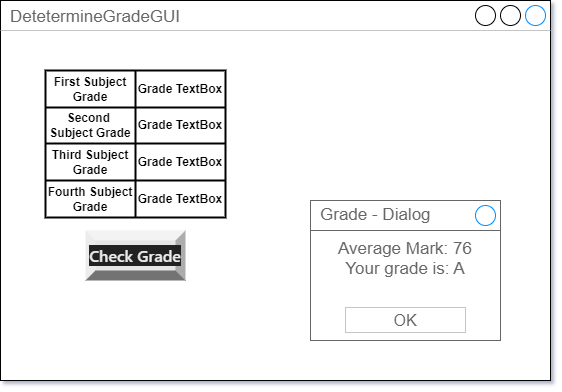
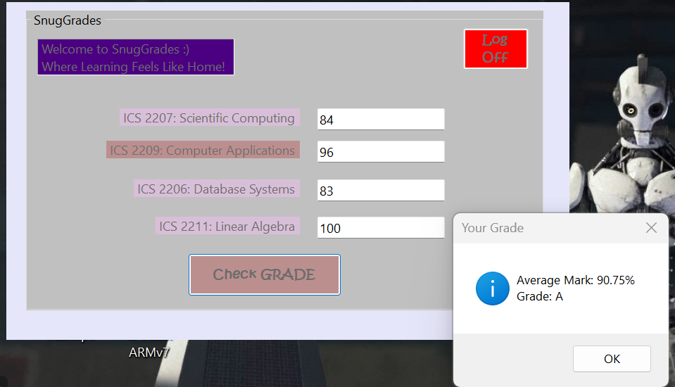

# GradeApp GUI

The GradeApp GUI is a user-friendly desktop application developed in Visual Basic (VB) that allows users to determine grades based on input marks. It provides a cozy and intuitive interface for calculating and displaying grades, making the process of grading academic performance simple and efficient.

## Features
- Input fields for entering marks in subjects.
- Calculation of grades based on entered marks.
- Clear and straightforward user interface for ease of use.
- LogOffButton to close the application conveniently.

--- 
## GradeApp GUI in snaps:  
### Sketch:

### Actual `GUI`

## Usage
1. Enter marks in the respective subjects.
2. Click on the "Determine Grade" button to calculate grades.
3. Use the LogOffButton to close the application.

## Built With:
- Visual Basic (VB)
- .NET Framework
